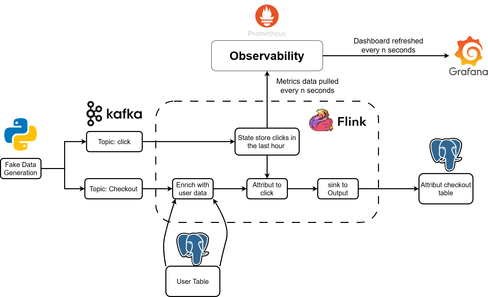
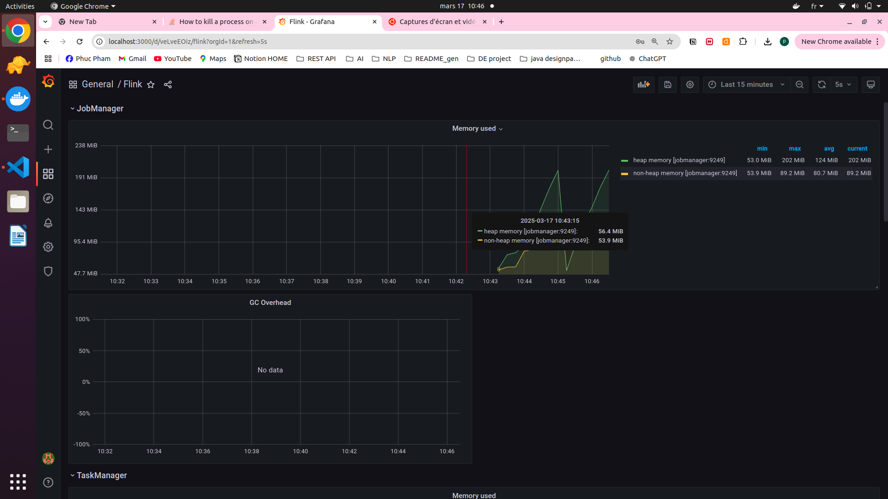
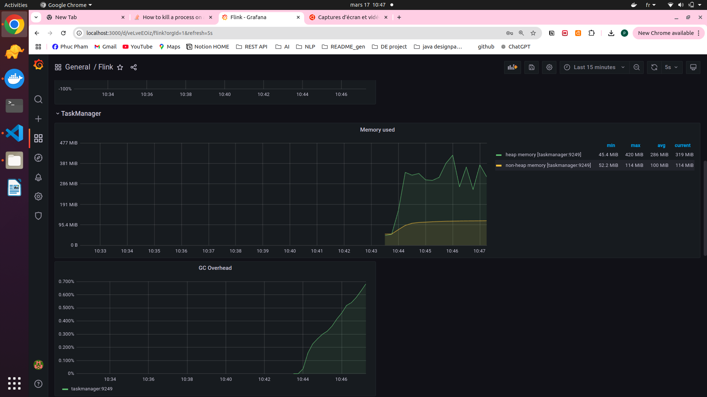
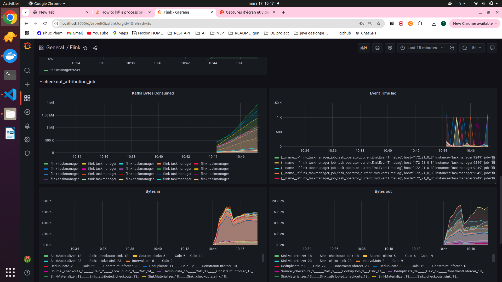
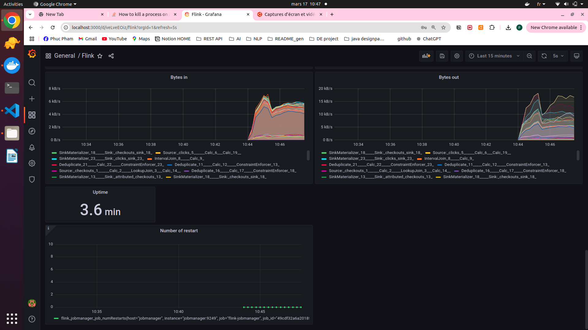

# Data Engineering Project - Stream Version

---

## Project

This project simulates an IoT use case where we aim to attribute every sensor data event to the first trigger that led to it.

The main objectives are:

- Set up Docker-based infrastructure: Configure Apache Flink, Kafka, PostgreSQL, Prometheus, and Grafana using Docker Compose.
- Stream data processing: Capture and process incoming event streams in real-time.
- Data enrichment: Enhance incoming events with additional metadata before storage.
- Attribution logic: Implement a transformation logic (e.g., mapping events to their respective sources based on time windows).
- Logging & storage: Persist processed data in PostgreSQL.
- Monitoring: Configure Prometheus and Grafana for observability and metrics visualization.

---

## **Project Structure**

```
├───code
│   ├───process       # Data transformation and enrichment logic
│   ├───sink          # Define how processed data is written to external systems
│   └───source        # Define how data is ingested from sources (Kafka, files, etc.)
├───container
│   ├───datagen       # Scripts or services to generate test data
│   └───flink         # Flink container configurations
├───datagen           # Standalone directory for event data generation scripts
├───grafana
│   └───provisioning  # Grafana setup automation
│       ├───dashboards    # Pre-configured Grafana dashboards
│       └───datasources   # Data source connections (Prometheus, PostgreSQL, etc.)
├───images            # Architecture diagrams, workflow visuals, screenshots
├───postgres          # PostgreSQL setup, schema, and initialization scripts
└───prometheus        # Prometheus configuration and alert rules
```

## **Pipeline Architecture**


1. **Data Source** → Generates and streams events into Kafka.
2. **Message Queue (Kafka)** → Acts as a messaging bus for real-time event streaming.
3. **Stream Processing (Apache Flink)** → Reads, transforms, and enriches events.
4. **Storage (PostgreSQL)** → Stores the processed and enriched data.
5. **Monitoring (Prometheus & Grafana)** → Observes and visualizes system health.

---

## Run on Codespaces

1. Create Codespaces from the repository.
2. Start the project using `make run`.
3. Access Flink UI via the `ports` tab and check the running job.

## Run Locally

### Prerequisites

Install the following:

- Git
- Docker and Docker Compose
- psql

For Windows, set up WSL and an Ubuntu virtual machine.

## Architecture

The pipeline architecture involves:

1. **Data Source**: Generates sensor event data.
2. **Queue**: Sends data to Kafka topics.
3. **Stream Processing**:
   - Store event data in cluster state.
   - Enrich sensor event data with metadata.
   - Join sensor data with metadata information.
4. **Logging**: Store the enriched and attributed sensor data in Postgres.
5. **Monitoring**: Use Prometheus and Grafana to monitor the pipeline.

---

## Code Design

We use Apache Table API for:

1. Defining source systems.
2. Processing data (enriching and attributing sensor events).
3. Defining sink systems.

The main function runs the data processing job by creating sources, sinks, and processing logic.

## Run Streaming Job

Clone the repository and start the job:

- **Flink UI**: Check the running job at `http://localhost:8081/`.
- **Grafana**: Visualize metrics at `http://localhost:3000`.

---

## Check Output

Open a Postgres terminal:

```sh
pgcli -h localhost -p 5432 -U postgres -d postgres
```

Query the attributed sensor events:

```sql
SELECT event_id, trigger_id, event_time, trigger_time, sensor_name FROM iot.attributed_events ORDER BY event_time DESC LIMIT 5;
```

---

## Tear Down

Use `make down` to stop the containers.

---
## Demo

###Dashboard demo






## References

- [Apache Flink docs](https://nightlies.apache.org/flink/flink-docs-stable/)
- [Flink Prometheus example project](https://nightlies.apache.org/flink/flink-docs-master/docs/ops/monitoring/)

